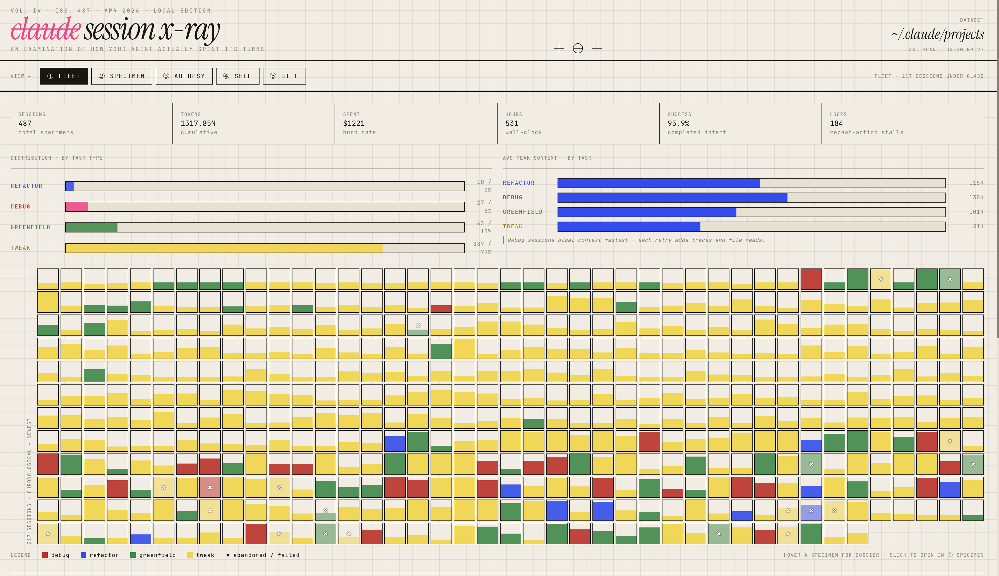
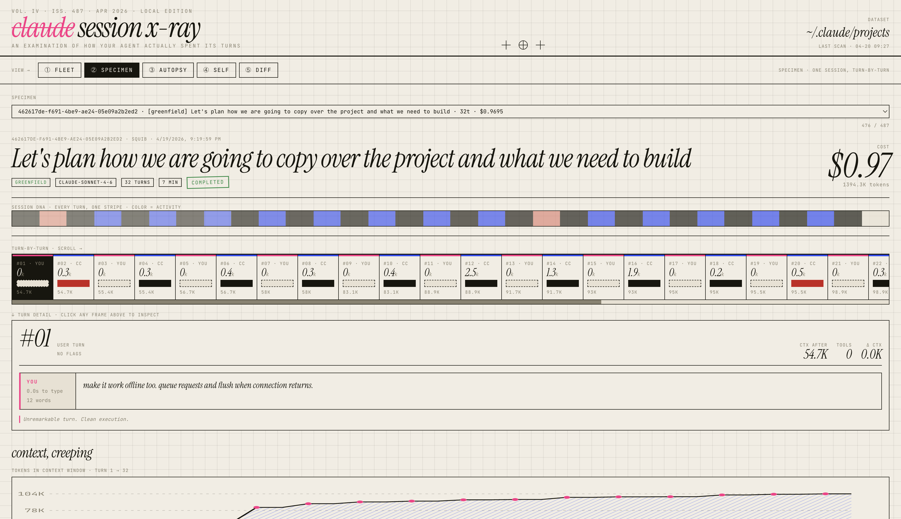

# Claude Session X-Ray

> An examination of how your agent actually spent its turns.

A local dashboard that reads your Claude Code session data from `~/.claude/projects/` and renders it as an interactive report. Tracks token usage, cost, context growth, cache efficiency, and behavioral patterns across every session on your machine.

No signup. No cloud. No `pip install`. Pure Python stdlib.

---





---

## Requirements

- Python 3.8+
- Claude Code with sessions in `~/.claude/projects/`

## Usage

```bash
git clone https://github.com/VinayakKaushikDH/claude-session-xray
cd claude-session-xray
python3 serve.py
```

Opens at `http://localhost:8642`.

| Flag | Description |
|------|-------------|
| `--force` | Full re-index from scratch (default is incremental) |
| `--port N` | Use a different port (default: 8642) |

---

## Views

**① Fleet** — all sessions at a glance. A color-coded grid of every session (tweak / debug / refactor / greenfield), task-type distribution charts, average peak context by task type, and fleet-wide KPIs: total sessions, tokens, estimated spend, wall-clock hours, success rate, and loop count.

**② Specimen** — single session deep dive. A session DNA stripe, scrollable turn-by-turn filmstrip showing input/output tokens and cost per turn, context growth chart, files touched, and tool call breakdown.

**③ Autopsy** — where sessions went wrong. Surfaces loop patterns (3+ consecutive turns hitting the same tool + target), failure signals, and context bloat events.

**④ Self** — you as a prompter, profiled. Prompt length distribution, hourly activity heatmap, and a ranked table of your worst-offender sessions by cost, context size, and loop count.

**⑤ Diff** — two sessions spliced side by side. Pick any two sessions from dropdowns and compare their token profiles, tool usage, and behavior patterns.

---

## How it works

Five pipeline steps run automatically on each launch:

1. **Index** — scans all `~/.claude/projects/**/*.jsonl`, extracts per-session token counts, cost estimates, and tool call breakdowns. Deduplicates by `message.id` so multi-block API responses are counted once.
2. **Enrich** — matches sessions to original prompts via `~/.claude/history.jsonl` (~44% match rate; analyses never require this field).
3. **Aggregate** — rolls sessions up into per-project summaries in `index/projects.json`.
4. **Context traces** — computes turn-by-turn context window size for qualifying sessions; writes per-session files to `index/context_turns/`.
5. **UI data** — packages everything into a single JSON bundle and injects it into `ui/template.html` → `ui/index.html`.

Results are cached in `index/` and only re-processed when source files change. Use `--force` to rebuild from scratch.

---

## Project layout

```
serve.py                  # Entry point — runs pipeline, builds UI, starts server
scripts/
  index_sessions.py       # Phase 1: scan + index
  enrich_index.py         # Phase 2: match to history
  aggregate_projects.py   # Phase 3: per-project rollup
  analyze_context_growth.py  # Phase 4: turn-by-turn traces
  generate_ui_data.py     # Phase 5: build window.DATA bundle
  pricing.json            # Per-model token pricing
index/
  sessions.json           # One entry per session file
  projects.json           # Per-project aggregates
  ui_data.json            # Final bundle consumed by the UI
  context_turns/          # Per-session turn traces
ui/
  template.html           # UI source (data injected at build time)
  index.html              # Built output (gitignored)
findings/                 # Human-readable markdown analysis reports
```

---

## Data privacy

Everything runs locally. The HTTP server binds to `127.0.0.1` only. No data leaves your machine.

---

## Known limitations

- **Haiku tokens not visible** — Claude Code's internal haiku calls don't appear in project JSONL files; they show up in `stats-cache.json` but can't be attributed to sessions.
- **Worktree sessions** — sessions from `claude-squad` worktrees are grouped under a single `home-directory` bucket; their source repos can't be recovered after the worktrees are deleted.
- **Cost estimates are approximate** — uses public Anthropic API pricing. Your actual rate may differ.
- **Prompt enrichment is partial** — only ~44% of sessions match a `history.jsonl` entry; the rest show no opening prompt.
